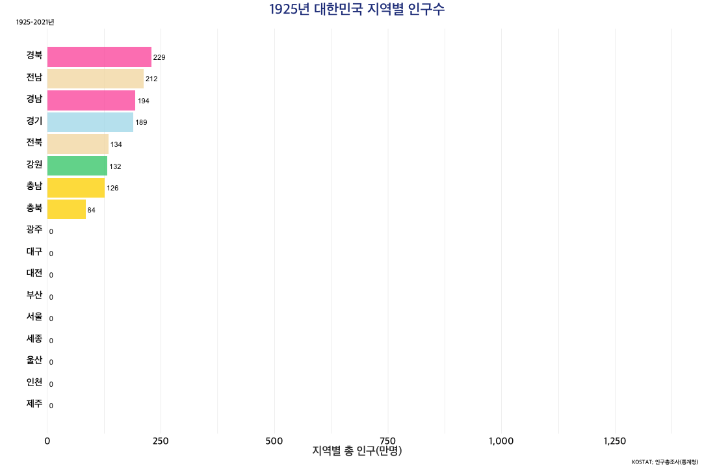

```{r echo=FALSE}
library(ggplot2)
library(ggpubr)
theme_set(theme_grey(base_family="NanumGothic")) #한글깨짐 문제 해결
```

# 2호선 지하철 혼잡도 분석
서울 지하철은 붐빈다. 자리도 없고 혼잡한 승차 시간엔 더 불편하다. 하지만, 이를 피하기 위한 작은 전략들이 있다. 아주 일찍 나가거나 늦게 가는 방법이다. 그렇다면 '정확히' 어느 시간에 가면될까? 마침 `datatoys`패키지에는 `busyMetro`데이터셋이 내장되어있다. 이는 서울교통공사 1-8호선 30분 단위 평균 혼잡도로 30분간 지나는 열차들의 평균 혼잡도(정원대비 승차인원)를 의미한다. 

```{r, message=FALSE}
library(tidyverse)
library(datatoys)
str(busyMetro)
```

먼저 시간별로 전체 지하철의 혼잡도를 살펴보자.

```{r}
busyMetro %>% 
   group_by(시간) %>% 
   summarise(평균혼잡도 = mean(혼잡도, na.rm = TRUE))
```

혼잡도를 그래프로 나타내 보면 다음과 같다. `geom_line()` 함수 안에 `aes(group = 1)`을 추가하여 모든 데이터 요소를 하나의 그룹으로 처리할 수 있다. 

```{r}
busyMetro %>% 
   group_by(시간) %>% 
   summarise(평균혼잡도 = mean(혼잡도, na.rm = TRUE)) %>% 
   ggplot(aes(시간, 평균혼잡도)) +
   geom_line(aes(group = 1)) +
   labs(title = "서울교통공사 지하철 시간대별 평균 혼잡도", subtitle = "평일 05:30 ~ 00:30")
```

화면비율이나 크기에 따라 다르겠지만, x축의 시간 변수가 겹쳐보인다. 이를 해결하기 위해 x축의 글자들을 45도 회전시켜보자.`theme()` 함수 안에 `axis.text.x = element_text(angle = 45, hjust = 1)`을 추가하면 된다. `hjust =`를 사용해서 높이를 약간 조절해준다.

```{r}
busyMetro %>% 
   group_by(시간) %>% 
   summarise(평균혼잡도 = mean(혼잡도, na.rm = TRUE)) %>% 
   ggplot(aes(시간, 평균혼잡도)) +
   geom_line(aes(group = 1)) +
   labs(title = "서울교통공사 지하철 시간대별 평균 혼잡도", subtitle = "평일 05:30 ~ 00:30") +
   theme(axis.text.x = element_text(angle = 45, hjust = 1))
```

확실히 출근시간과 퇴근시간 대에 피크를 볼 수 있다. 그렇다면 평일과 주말의 양상은 어떻게 다를까? `geom_line()` 함수 안에 `aes(color = 요일구분)`을 추가하면 요일별로 색상을 다르게 표현할 수 있다. scale_color_manual() 함수를 이용해 색상을 직접 지정할 수도 있다. 

```{r}
busyMetro %>% 
  group_by(요일구분, 시간) %>%
  summarise(평균혼잡도 = mean(혼잡도, na.rm = TRUE)) %>%
  ggplot(aes(시간, 평균혼잡도)) +
  geom_line(aes(group = 요일구분, color = 요일구분)) +
  scale_color_manual(values = c("#E966A0", "#213363", "#8EAC50")) +
  labs(title = "서울교통공사 지하철 시간대별 평균 혼잡도", subtitle = "평일 05:30 ~ 00:30") +
  theme(axis.text.x = element_text(angle = 45, hjust = 1))
```

`## Warning: Removed 4 rows containing missing values geom_line().`라는 경고문구가 나타난다. 주말이나 공휴일에는 지하철 운행시간이 달라 데이터가 존재하지 않기 때문이다. legend 위치를 조절하기 위해서는 `theme()` 함수 안에 `legend.position =`을 추가하면 된다. 

```{r}
busyMetro %>% 
  group_by(요일구분, 시간) %>%
  summarise(평균혼잡도 = mean(혼잡도, na.rm = TRUE)) %>%
  ggplot(aes(시간, 평균혼잡도)) +
  geom_line(aes(group = 요일구분, color = 요일구분)) +
  scale_color_manual(values = c("#E966A0", "#213363", "#8EAC50")) +
  labs(title = "서울교통공사 지하철 시간대별 평균 혼잡도", subtitle = "평일 05:30 ~ 00:30") +
  theme(
    axis.text.x = element_text(angle = 45, hjust = 1),
    legend.position = "bottom"
  )
```


이번에는 호선별로 평일 지하철 혼잡도를 살펴보자. `facet_wrap()` 함수를 이용하면 호선별로 그래프를 나눌 수 있다. `facet_wrap()` 함수 안에 `. ~호선`을 추가하면 호선별로 그래프를 나눌 수 있다. `strip.position = "bottom"`을 추가하면 그래프의 하단에 호선명이 나타난다. 

```{r}
busyMetro %>% 
   filter(요일구분 == "평일") %>% 
   group_by(호선, 시간) %>%
   summarise(평균혼잡도 = mean(혼잡도, na.rm = TRUE)) %>%
   ggplot(aes(시간, 평균혼잡도)) +
   geom_line(aes(group = 1)) +
   facet_wrap(. ~호선, ncol = 2, strip.position = "top") +
   labs(title = "서울교통공사 지하철 시간대별 혼잡도", subtitle = "평일 05:30 ~ 00:30") +
   theme(axis.text.x = element_text(angle = 45, hjust = 1))
```

가장 붐비는 지하철 역은 어딜까?

```{r}
very_busy <- busyMetro %>% 
  filter(요일구분 == "평일") %>% 
  group_by(출발역, 상하구분) %>%
  summarise(평균혼잡도 = mean(혼잡도, na.rm = TRUE)) %>%
  arrange(desc(평균혼잡도)) %>%
  head(20)

very_busy
```

평일 평균 혼잡도가 가장 높은 상위 20개 역을 선정하였다. 그럼 각 역의 시간대별 혼잡도를 살펴보자. `filter()` 함수를 이용해 평일 데이터만 추출하고, `mutate()` 함수를 이용해 출발역 변수를 생성한다. `paste()` 함수를 이용해 호선, 상하구분과 출발역을 붙여주었다. `facet_wrap()` 함수를 이용해 출발역별로 그래프를 나누었다. `element_blank()`를 사용하면 축의 텍스트를 제거할 수 있다.

```{r}
very_busy %>% 
  select(출발역, 상하구분) %>% 
  left_join(busyMetro, by = c("출발역", "상하구분")) %>%
  filter(요일구분 == "평일") %>%
  mutate(출발역 = paste(호선, "호선", 출발역, 상하구분)) %>%
  ggplot(aes(시간, 혼잡도, color = 상하구분)) +
  geom_line(aes(group = 상하구분)) +
  facet_wrap(. ~출발역, ncol = 5, strip.position = "bottom") +
  labs(
    title = "서울교통공사 지하철 시간대별 혼잡도",
    subtitle = "상위 20개 역; 평일 05:30 ~ 00:30"
  ) +
 theme(axis.text.x = element_blank())
```

평일 붐비는 지하철이 싫다면, 저 시간대를 피하거나 다른 경로를 이용해 보는건 어떨까?

# 손없는 날 판별하기 (함수)
손없는 날(損-)에서의 손은 사람의 활동을 방해하고 사람에게 해코지 한다는 악귀 또는 악신을 뜻하며, 나쁜 귀신이 돌아다니지 않아 인간에게 해를 끼치치 않는 길한 날을 의미한다. 음력 날짜로는 9와 0[1]으로 끝나는 날이며, 8개의 모든 방향으로 귀신이 활동하지 않는 길일이다. 따라서 이날에 수리, 이사, 혼례, 개업 등을 하면 상서롭다고 믿으며 주요행사의 날짜를 정하는 기준이 된다. `datatoys`의 `Kcalendar` 데이터셋에서는 한국천문연구원에서 제공하는 날짜와 관련된 다양한 데이터를 제공한다. 이 중 날짜 별 손없는 날을 제공하는데, 손없는 날을 찾는 간단한 함수를 한번 만들어보자. 먼저 데이터는 아래와 같다.

```{r}
library(datatoys)
library(dplyr)

str(Kcalendar)
```

손없는날을 찾는 함수를 만들어보자.

```{r}
find_son <- function(date) {
  son <- datatoys::Kcalendar %>% 
    filter(양력날짜 == date) %>% 
    pull(손없는날)
  
  return(son)
}

find_son(date = "2024-01-01")
find_son(date = "2024-01-02")
```

임의의 날짜를 입력하면 손없는 날인지 아닌지를 판별해주는 함수를 만들었다. 하지만 TRUE 또는 FALSE로 표현되는 함수는 보기 친절하지 않다. 손없는 날이면 "손없는 날입니다."라는 메시지를, 손없는 날이 아니면 "손없는 날이 아닙니다."라는 메시지를 출력하는 함수를 만들어보자. `if()` 함수를 이용해 손없는 날인지 아닌지를 판별하고, `paste0()` 함수를 이용해 메시지를 출력한다. 만약 `son == FALSE`라면 `else{}` 함수를 이용해 "손없는 날이 아닙니다."라는 메시지를 출력한다.

```{r}
find_son <- function(date) {
  son <- datatoys::Kcalendar %>% 
    filter(양력날짜 == date) %>% 
    pull(손없는날)
  
  if(son == TRUE) {
    message <- paste0(date,"은 '손없는 날' 입니다.")  
  } else {
    message <- paste0(date,"은 '손없는 날'이 아닙니다.")  
  }
  
  return(message)
}

find_son(date = "2024-01-01")
find_son(date = "2024-01-02")
```

## map() 함수
R에서 반복된 작업을 수행할 때 `purrr` 패키지의 여러 함수들을 사용할 수 있다. `purrr` 패키지는 함수형 프로그래밍 패러다임을 지원하는 패키지로, `map()` 함수를 이용해 반복된 작업을 수행할 수 있다. `map()` 함수는 리스트, 벡터, 데이터프레임 등의 객체에 함수를 적용해주는 함수로, `map()` 함수의 첫번째 인자에는 적용할 함수를, 두번째 인자에는 적용할 객체를 입력한다. `map()` 함수는 `for` 반복문과 유사한 기능을 수행한다. 

`map()` 함수를 이용해 손없는 날인지 아닌지를 판별해보자.

```{r}
library(purrr)

date <- c("2024-01-01", "2024-01-02", "2024-01-03", "2024-01-04", "2024-01-05", "2024-01-06", "2024-01-07", "2024-01-08", "2024-01-09", "2024-01-10")

map(date, find_son)
```

`map()` 함수는 기본적으로 리스트(list) 형태의 값을 반환한다. 만약 데이터프레임 형태로 값을 반환하고 싶다면 `map_df()` 함수를 사용한다.

```
map_df(date, find_son)
```

아마도 아래와 같은 에러 메시지를 반환할 것이다.

```
> map_dfr(date, find_son)
Error in `dplyr::bind_rows()`:
! Argument 1 must have names.
Run `rlang::last_error()` to see where the error occurred.
```

이는 `find_son()` 함수가 데이터프레임 형태를 반환하지 않기 때문에 발생하는 에러이다. `find_son()` 함수를 수정해보자.

```{r}
find_son <- function(date) {
  son <- datatoys::Kcalendar %>% 
    filter(양력날짜 == date) %>% 
    pull(손없는날)
  
  if(son == TRUE) {
    message <- paste0(date,"은 '손없는 날' 입니다.")  
  } else {
    message <- paste0(date,"은 '손없는 날'이 아닙니다.")  
  }
  
  return(data.frame(date = date, message = message))
}

map_df(date, find_son)
```


# 서울시 급똥 지도
생각만해도 무시무시한 상황이 있다. 바로 '급똥이 마려울 때'다. 이럴 때는 어떻게 해야할까? `datatoys`의 `seoulRestroom` 데이터셋을 이용해 급똥이 마려울 때 화장실을 찾아보자. 이는 서울시 공중화장실 현황정보를 제공한다.

```{r}
str(seoulRestroom)
```

열의 이름에 괄호가 들어가 있다. 이런 경우 `dplyr` 패키지의 `rename()` 함수를 이용해 열의 이름을 변경할 수 있다.

```{r}
restroom <- seoulRestroom %>% 
  rename(
    "구이름" = "주소(구)",
    "동이름" = "주소(동)"
  )

str(restroom)
```

또는 `jonitor` 패키지의 `clean_names()` 함수를 사용할 수도 있다.

```{r}
library(janitor)

restroom <- seoulRestroom %>% 
  clean_names(ascii = FALSE)
```

먼저 가장 화장실에 진심인 동네를 찾아보자.

```{r}
restroom %>% 
  group_by(주소_구) %>% 
  summarise(화장실개수 = n()) %>% 
  arrange(desc(화장실개수)) %>% 
  head(20)

restroom %>% 
  group_by(주소_구, 주소_동) %>% 
  summarise(화장실개수 = n()) %>% 
  arrange(desc(화장실개수)) %>% 
  head(20)
```

여의도동이 211개로 가장 많았고 서초동이 뒤를 이었다. `ggplot2`를 사용해 시각화 해보자.

```{r}
restroom %>% 
  group_by(주소_구, 주소_동) %>% 
  summarise(화장실개수 = n()) %>% 
  arrange(desc(화장실개수)) %>% 
  head(20) %>%
  ggplot(aes(x = reorder(주소_동, 화장실개수), y = 화장실개수)) +
  geom_col() +
  geom_text(aes(label = 화장실개수), hjust = -0.) +
  coord_flip() +
  ggthemes::theme_fivethirtyeight(base_family="NanumGothic") +
  labs(
    title = "급똥이 마려울 때 생존 확률이 높은 동네 TOP 20",
    subtitle = "서울시 구별 화장실 개수"
  )
```

마지막으로 실제 서울시 화장실의 위치를 시각화해보자. 

```{r}
library(leaflet)
leaflet(seoulRestroom) %>% 
  addTiles() %>% 
  setView(lng = 126.9784, lat = 37.566, zoom = 11) %>% 
  addProviderTiles('CartoDB.Positron') %>% 
  addCircles(lng = ~경도, lat = ~위도,
             label = ~`주소(동)`)
```

보다 자세한 화장실 위치가 파악 된다. 부디 급똥이 마려울 때 이 지도를 참고해 최악의 상황을 피하길 기원한다.


# 대한민구 인구수 변화 시각화

```
library(gganimate)

population <- datatoys::population
population <- subset(population, 행정구역별 != "황해도" & 행정구역별 != "평안북도" & 행정구역별 != "평안남도" & 행정구역별 != "함경북도" & 행정구역별 != "함경남도" & 행정구역별 != "함경북도")
population <- population %>%
  mutate(
    행정구역별 = recode(행정구역별, "서울특별시" = "서울", "부산광역시" = "부산", "충청북도" = "충북", "충청남도" = "충남", 
                   "전라북도" = "전북", "전라남도" = "전남", "경상북도" = "경북", "경상남도" = "경남", "대구광역시" = "대구", 
                   "광주광역시" = "광주", "대전광역시" = "대전", "울산광역시" = "울산", "인천광역시" = "인천", "경기도" = "경기", 
                   "강원도" = "강원", "제주도" = "제주", "세종특별자치시" = "세종", "제주특별자치도" = "제주")
  ) %>%
  group_by(행정구역별, 연도) %>%
  summarise(
    인구수_10000 = round(sum(인구수, na.rm = TRUE) / 10000)
  ) %>%
  ungroup() %>%
  group_by(연도) %>%
  arrange(연도, desc(인구수_10000)) %>%
  mutate(
    rank = row_number(),
    인구수_char = paste0(" ", 인구수_10000)
  ) %>%
  ungroup()

area_palette <- c(
  "경남" = "#FF65AE",
  "경북" = "#FF65AE",
  "대구" = "#F763E0",
  "울산" = "maroon",
  "부산" = "lightpink1",
  "전남" = "wheat",
  "전북" = "wheat",
  "광주" = "tan",
  "경기" = "lightblue2",
  "서울" = "steelblue1",
  "인천" = "turquoise",
  "충남" = "gold",
  "충북" = "gold",
  "대전" = "yellow2",
  "세종" = "goldenrod2",
  "강원" = "seagreen3",
  "제주" = "darkgrey"
)

total_population <- ggplot(population, aes(rank, group = 행정구역별)) +
  geom_tile(aes(
    y = 인구수_10000 / 2,
    height = 인구수_10000,
    width = 0.9, fill = 행정구역별), 
    alpha = 0.8) +
  geom_text(aes(y = 0, label = paste(행정구역별, " ")), vjust = 0.2, hjust = 1, size = 5, family = "AppleSDGothicNeo-SemiBold") +
  geom_text(aes(y = 인구수_10000, label = 인구수_char, hjust = 0)) +
  theme_minimal(base_family = "AppleSDGothicNeo-SemiBold") +
  theme(
    axis.text.x = element_text(size = 15, color = "grey3", face = "bold"),
    axis.title = element_text(size = 17, color = "grey21", face = "bold"),
    legend.position = "none",
    plot.title = element_text(hjust = 0.5, size = 22, color = "royalblue4", face = "bold"),
    axis.line = element_blank(),
    axis.text.y = element_blank(),
    panel.grid.major = element_blank(),
    panel.grid.minor = element_blank(),
    panel.grid.major.x = element_line(size = 0.1, color = "grey"),
    panel.grid.minor.x = element_line(size = 0.1, color = "grey"),
    plot.background = element_blank()
  ) +
  transition_states(연도,
                    transition_length = 40,
                    state_length = 10
  ) +
  scale_y_continuous(breaks = seq(0, 1500, 250), labels = scales::comma) +
  scale_x_reverse() +
  scale_fill_manual(values = area_palette) +
  labs(
    title = "{closest_state}년 대한민국 지역별 인구수",
    subtitle = "1925-2021년",
    caption = "KOSTAT; 인구총조사(통계청)",
    x = "",
    y = "지역별 총 인구(만명)"
  ) +
  coord_flip() +
  ease_aes("quartic-in-out") +
  enter_fade()

animate(plot = total_population, nframes = 400, end_pause = 20, width = 1080, height = 720)
```

```{r, echo=FALSE, out.width='100%'}

```


# 울릉도의 버스정류장
울릉도에는 버스정류장이 얼마나 있고 어디에 위치하고 있을까? `datatoys`의 busStation 데이터와 `leaflet` 패키지를 이용해 울릉도의 버스정류장을 분석해보자. `busStation` 데이터셋은 버스정보시스템(BIS)이 구축된 지자체 중 국가대중교통정보센터(TAGO)와 연계된 136개 지자체에 대한 버스정류장 위치정보 데이터를 제공한다.

```{r error=FALSE, message=FALSE}
library(datatoys)
library(leaflet)
library(dplyr)

busStation %>% 
  filter(도시명 == "울릉군") %>%
  leaflet() %>% 
  addTiles() %>% 
  addMarkers(~경도, ~위도, popup = ~as.character(정류장.명칭), label = ~as.character(정류장.명칭))
```


